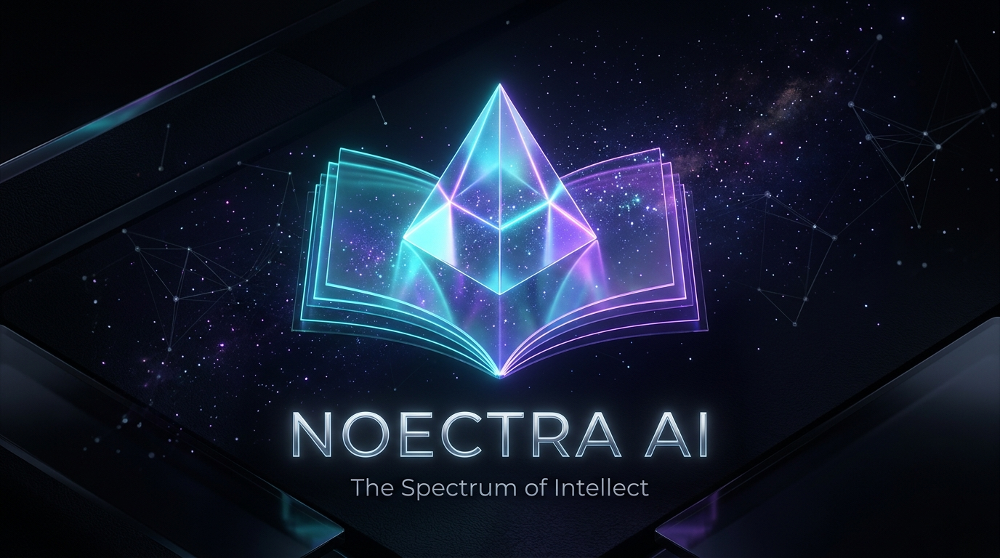
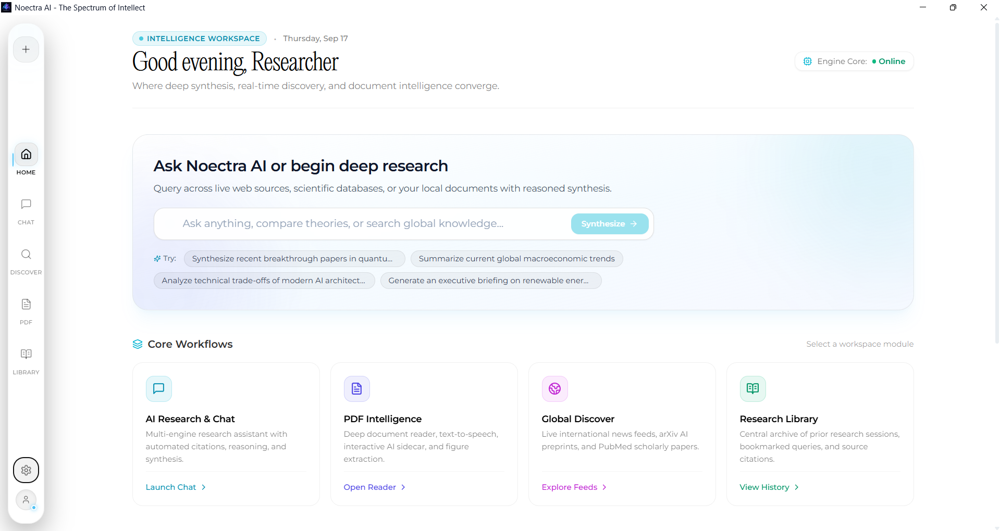
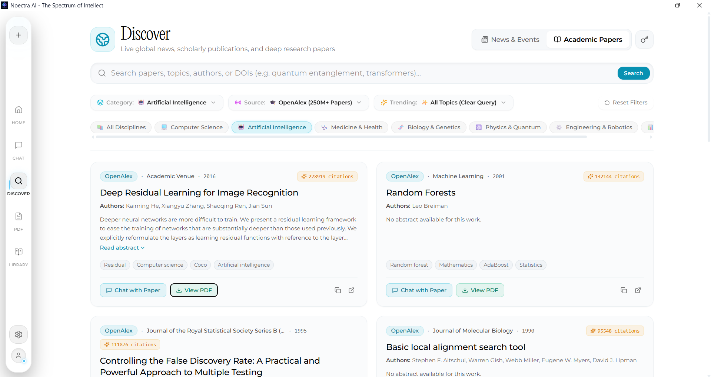
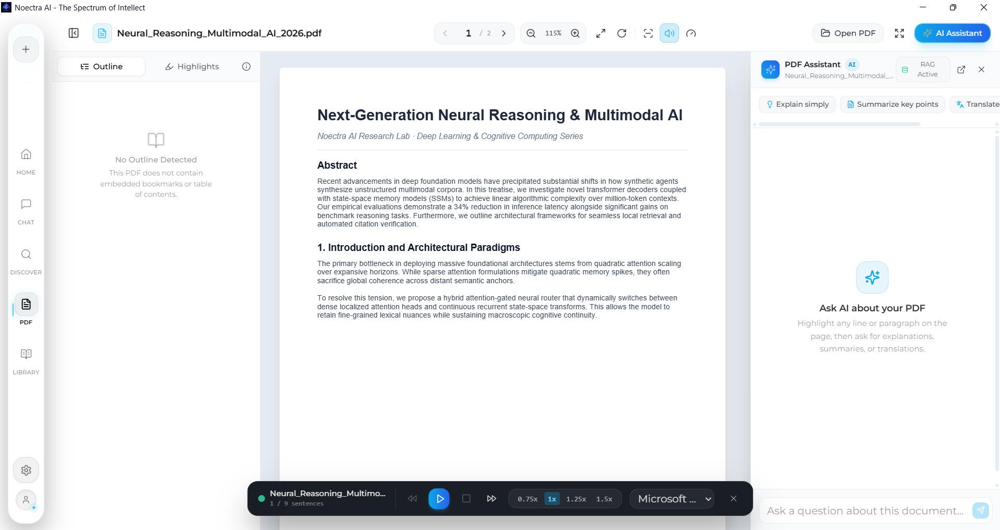
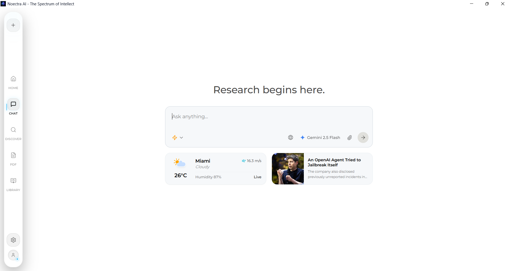
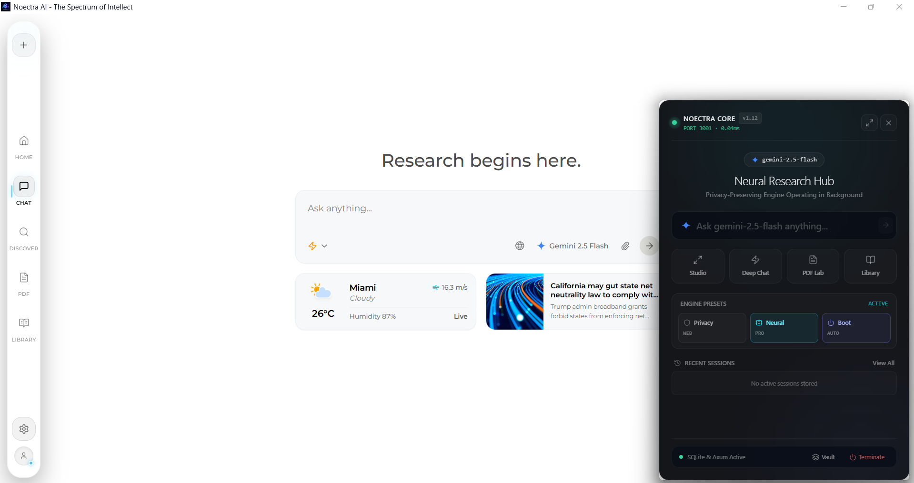

<div align="center">



# 🌌 Noectra AI — The Spectrum of Intellect

**Next-Generation AI Desktop Research, Document Intelligence & Reading Platform**

[](https://github.com/amirrezamortazavifard/noectra-ai/releases)
[](https://tauri.app/)
[](https://www.rust-lang.org/)
[](https://react.dev/)
[](https://www.typescriptlang.org/)
[](https://opensource.org/licenses/MIT)

[⬇️ Download Releases](https://github.com/amirrezamortazavifard/noectra-ai/releases) • [Visual Tour](#-preview--visual-tour) • [Features](#-key-features) • [Getting Started](#-getting-started)

</div>

---

## 📖 Overview

**Noectra AI** is an ultra-fast, local-first desktop application designed for researchers, developers, students, and avid readers. Combining the raw power and memory safety of **Rust (Tauri v2)** with an elegant **React 18 + TailwindCSS** luxury dark interface, Noectra AI unifies live web reading, academic exploration, AI-assisted document analysis, and news tracking into one distraction-free workspace.

---

## 📸 Preview & Visual Tour

<div align="center">

### 🧠 Intelligence Workspace & Core Workflows
*Unified distraction-free research landing interface featuring the prompt synthesizer and quick workflow dispatchers.*
<br />


<br /><br />

### 🔬 Academic Research & OpenAlex Discovery Hub
*Direct exploration across 250M+ scientific papers, real-time citation metrics, and multi-discipline academic filtering.*
<br />


<br /><br />

### 📑 Universal PDF & Document Intelligence Studio
*Split-screen document reading lab with interactive vector RAG sidecar assistant, speed reader, and text-to-speech audio narration.*
<br />


<br /><br />

### 💬 AI Research & Synthesis Chat
*Multi-engine conversational reasoning workspace with live environmental telemetry, breaking news widgets, and model selector.*
<br />


<br /><br />

### ⚡ Noectra Core Quick Hub (System Tray Companion)
*Zero-latency floating companion overlay for instant background queries, engine presets, and quick workspace navigation.*
<br />


</div>

---

## ✨ Key Features

- **🌐 In-App Anti-Blocking Web Viewer (Live Web):**
  - Built-in local Rust HTTP proxy (`/api/proxy_article`) that strips `X-Frame-Options` and strict CSP headers.
  - Seamlessly renders live news articles (Wired, The Verge, Reuters, etc.) inside the app without "refused to connect" iframe errors.

- **📖 Distraction-Free Reader Mode:**
  - High-performance text extraction preserving paragraphs, headings, and lists up to 60,000 characters.
  - Centered ergonomic reading modal with customizable typography, dark luxury theme, and instant **Maximize / Restore** toggle.

- **🤖 Multi-Model AI Intelligence:**
  - Native integration with **Google Gemini**, **OpenRouter**, **Local LLMs / Ollama**, and custom OpenAI-compatible endpoints.
  - One-click **"Summarize with AI"** on any news article, research paper, or document.

- **📡 Curated Discover & RSS Engine:**
  - Real-time aggregated feeds across **Tech & AI**, **Business & Finance**, **Science & Space**, **Health**, **Sports**, and **World Politics**.
  - Smart thumbnail and media extraction with incremental **"Show More"** pagination.

- **🔬 Academic Research Hub:**
  - Direct search and ingestion of academic papers from **arXiv** and research repositories.
  - View abstracts, authors, publication dates, and launch direct AI discussions.

- **📑 Advanced Document & PDF Reader:**
  - Integrated PDF and EPUB viewer with split-screen AI co-pilot.
  - Highlighting, sticky notes, RSVP speed reading mode, reading rulers, and text-to-speech (TTS).

- **⚡ Tray Companion Hub:**
  - Lightweight system tray companion window for quick notes, instant queries, and productivity widgets.

---

## 🚀 Getting Started

### Prerequisites

Ensure you have the following installed on your machine:
- **Node.js**: `v18.0` or later ([Download Node.js](https://nodejs.org/))
- **Rust & Cargo**: Latest stable release ([Install Rust](https://www.rust-lang.org/tools/install))
- **C++ Build Tools**:
  - **Windows**: Microsoft Visual Studio C++ Build Tools
  - **macOS**: Xcode Command Line Tools (`xcode-select --install`)
  - **Linux**: Standard development libraries (WebKitGTK, libsoup, etc. — see [Tauri Linux Guide](https://tauri.app/start/prerequisites/))

### 1. Clone the Repository

```bash
git clone https://github.com/amirrezamortazavifard/noectra-ai.git
cd noectra-ai
```

### 2. Install Dependencies

```bash
npm install
```

### 3. Setup Configuration

Copy the example configuration file to initialize your local settings:

```bash
# On Linux/macOS
cp data/config.example.json data/config.json

# On Windows (PowerShell)
Copy-Item data/config.example.json data/config.json
```

Add your preferred AI model API keys (e.g. Gemini or OpenRouter) via the in-app Settings dialog or by editing `data/config.json`.

---

## 💻 Development & Building

### Run in Development Mode

Launches the Vite frontend server with hot-reload and the Tauri desktop window simultaneously:

```bash
npm run tauri dev
```

### Build for Production

Creates an optimized standalone binary and installer (`.msi` / `.exe` on Windows, `.dmg` / `.app` on macOS, `.deb` / `.AppImage` on Linux):

```bash
npm run tauri build
```

The compiled binaries will be output to `src-tauri/target/release/bundle/`.

---

## 🔒 Security & Privacy

- **100% Local-First:** All chat histories, documents, and preferences are stored in your local SQLite database (`data/vane.db`).
- **Secret Protection:** API keys and sensitive configuration files are strictly excluded from version control via `.gitignore`.
- **Zero Telemetry:** No personal data or browsing activity is tracked or sent to third-party tracking servers.

---

## 🤝 Contributing

Contributions, issues, and feature requests are welcome!
1. Fork the Project.
2. Create your Feature Branch (`git checkout -b feature/AmazingFeature`).
3. Commit your Changes (`git commit -m 'feat: Add AmazingFeature'`).
4. Push to the Branch (`git push origin feature/AmazingFeature`).
5. Open a Pull Request.

---

## 🙏 Acknowledgments & Credits

Noectra AI stands on the shoulders of giants and gratefully incorporates inspirations and architectural foundations from remarkable open-source projects:

- **[Vane](https://github.com/ItzCrazyKns/Vane)** by [@ItzCrazyKns](https://github.com/ItzCrazyKns): For the privacy-first AI answering architecture, multi-provider model orchestration, and desktop windowing patterns.
- **[Readest](https://github.com/readest/readest)**: For pioneering modern document reading experiences, ergonomic typography, RSVP speed reading concepts, and multi-format reader utilities.
- **[Tauri](https://tauri.app/)**: For providing the blazingly fast, secure, and lightweight Rust desktop framework.
- All open-source maintainers whose libraries and tools power this platform.

---

## 📄 License

Distributed under the **MIT License**. See `LICENSE` for more information.

---

<div align="center">
  <sub>Built with ❤️ by <a href="https://github.com/amirrezamortazavifard">Amirreza Mortazavi Fard</a></sub>
</div>

